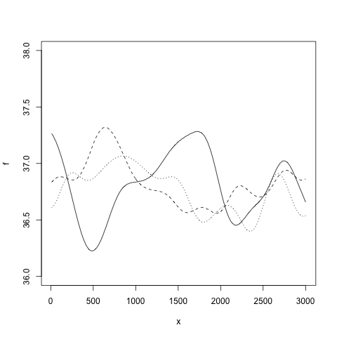
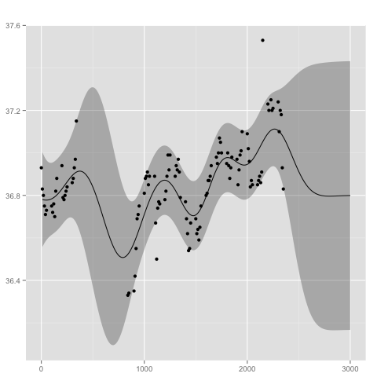
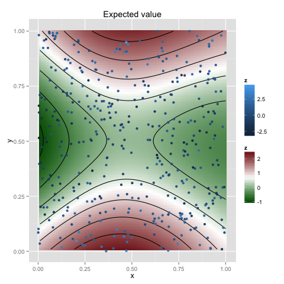
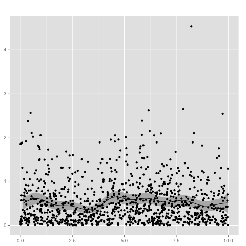
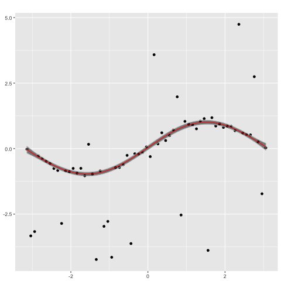

## Installation

To install the package simply type

	make install

The package requires *roxygen2*, *ggplot2*, *Matrix* and a couple of other libraries.

#### OpenBLAS

It is recommended to use this library with a threaded version of OpenBLAS. See

	https://cran.r-project.org/doc/manuals/r-devel/R-admin.html#BLAS

## Introduction

A first example:

	gp <- new.gp(36.8, kernel.squared.exponential(200, 0.1))

This creates a Gaussian process with prior mean *36.8* and a squared exponential kernel. The likelihood model is a Gaussian with variance *1*. With

	gp <- new.gp(36.8, kernel.squared.exponential(200, 0.1),
	      	     likelihood=new.likelihood("normal", 0.1))

the variance of the likelihood model is set to *0.1*. Samples from the prior Gaussian process can be drawn with

	draw.sample(gp, 1:300*10, ep=0.000001)

Assuming we have the following observations

	library(MASS)

	xp <- beav1$time
	yp <- beav1$temp

we may compute the posterior Gaussian processs with

	gp <- posterior(gp, xp, yp)

The posterior distribution can be summarized and visualized at locations *x* with

	x <- 1:300*10

	summarize(gp, x)

	plot(gp, x)

Data with higher-dimensional covariantes can be analysed in the same way, e.g. for two dimensions

	np <- 400
	xp <- cbind(x1 = runif(np), x2 = runif(np))
	yp <- sin(pi*xp[,1]) + cos(2*pi*xp[,2]) + rnorm(np, 0, 1)

	gp <- new.gp(0.5, kernel.squared.exponential(0.5, 1), dim=2)
	gp <- posterior(gp, xp, yp, 1)

	x  <- as.matrix(expand.grid(x = 1:100/100, y = 1:100/100))
	plot(gp, x, plot.scatter=TRUE, plot.variance=FALSE)

### Kernel functions

Name | Constructor |Parameters
-----|-------------|----------
Linear | *kernel.linear* | variance_0, variance, c (offset)
Squared exponential | *kernel.squared.exponential* | l, variance
Gamma exponential | *kernel.gamma.exponential* | l, variance, gamma
Periodic | *kernel.periodic* | l, variance, p (periodicity)
Locally periodic | *kernel.locally.periodic* | l, variance, p (periodicity)
Ornstein-Uhlenbeck | *kernel.ornstein.uhlenbeck* | l, variance
Matern | *kernel.matern* | l, variance, nu
Combined kernel | *kernel.combined* | k1, k2, ..., kn (kernel functions)

### Likelihood models and link functions

#### Gamma likelihood model

The following example creates a Gaussian process with gamma likelihood. Since the domain of the gamma distribution is the positive reals, we need a link function, such as the *logistic* function, to transform the process.

	gp <- new.gp(1.0, kernel.squared.exponential(1.0, 5.0),
		     likelihood=new.likelihood("gamma", 1.0),
		     link=new.link("logistic"))

The shape of the gamma likelihood is set to *1.0*, whereas the mean is determined by the Gaussian process. Given the observations

	n  <- 1000
	xp <- 10*runif(n)
	yp <- rgamma(n, 1, 2)

we obtain the posterior distribution with

	# add some tiny noise to the diagonal for numerical stability
	gp <- posterior(gp, xp, yp, ep=0.01, verbose=TRUE)
	summarize(gp, 0:10/5)

	plot(gp, 1:100/10)

#### Binomial likelihood

The *probit* link function can be used for binomial observations. In this case there is no specific likelihood model needed.

	gp <- new.gp(0.5, kernel.squared.exponential(1, 0.25),
		     likelihood=NULL,
		     link=new.link("probit"))

The observations are given by

	xp <- c(1,2,3,4)
	yp <- matrix(0, 4, 2)
	yp[1,] <- c(2, 14)
	yp[2,] <- c(4, 12)
	yp[3,] <- c(7, 10)
	yp[4,] <- c(15, 8)

where *xp* is the locations of the observations and *yp* contains the count statistics (i.e. number of heads and tails).

### Heteroscedastic Gaussian process

Heteroscedasticity can be modeled with a second Gaussian process for the variance of the likelihood model. An example is given by

	gp <- new.gp.heteroscedastic(
		new.gp( 0.0, kernel.squared.exponential(4, 100)),
		new.gp(10.0, kernel.squared.exponential(4,  10),
		       likelihood=new.likelihood("gamma", 1),
		       link=new.link("logistic")),
		transform     = sqrt,
		transform.inv = function(x) x^2)

where the second Gaussian process uses a gamma likelihood model in combination with a logistic link function. The empirical variances are transformed by taking the square root. Testing the model on the *mcycle* data set

	data("mcycle", package = "MASS")

	gp <- posterior(gp, mcycle$times, mcycle$accel, 0.00001,
	                step = 0.1,
	                epsilon = 0.000001,
	                verbose=T)

gives the following result

### Robust regression with heavy-tailed distributions

Heavy-tailed distributions, such as Student's t-distribution, are useful for modeling data that include outliers. Rasmussen's mode finding (a stabilized Newton's method, originally implemented in [GPML](http://www.gaussianprocess.org/gpml/code/matlab/doc/)) can be used for performing inference with Student's-t likelihood, which can be used for robust regression. Let us first generate a corrupted sin wave by

	makeCorruptedSin <- function(x, basenoise, number_of_corruption, corruptionwidth){
            y_clean = sin(x)
            y = y_clean + rnorm(length(x),sd = basenoise)
            corruption_points = floor(runif(min=1, max=length(x),n = number_of_corruption))
            for (index in corruption_points){
                y[[index]] = y[[index]] + runif(min=-corruptionwidth, max=corruptionwidth, n = 1)
            }
            return(y)
	}
	x = seq(from=-3.14, to=3.14, by=0.1)
	y = makeCorruptedSin(x, basenoise = 0.1, number_of_corruption = 25, corruptionwidth = 4)

on which a Gaussian process with a Gaussian likelihood model 

	gp_n <- new.gp(0, kernel.squared.exponential(2, 2),
	likelihood=new.likelihood("normal", 0.1))
	gp_n <- posterior(gp_n, x, y)
	plot(gp_n,x)

performs poorly. In contrast, a Gaussian process with a Student's t likelihood 
	
	gp_t <- new.gp(0, kernel.squared.exponential(2, 2),
             likelihood=new.likelihood("t", 2.1, 0.1))
	gp_t <- posterior(gp_t, x, y, ep= 0.00000001, epsilon = 0.000001,
                    verbose = TRUE, modefinding='rasmussen')
	plot(gp_t,x)

captures the ground truth well. 
