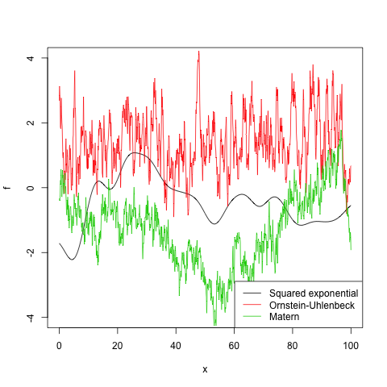

## Installation

To install the package simply type

	make install

The package requires *roxygen2*, *ggplot2*, *Matrix* and a couple of other libraries.

## Introduction

A first example:

	gp <- new.gp(36.8, kernel.exponential(200, 0.1))

This creates a Gaussian process with prior mean *36.8* and a squared exponential kernel. The likelihood model is a Gaussian with variance *1*. With

	gp <- new.gp(36.8, kernel.exponential(200, 0.1),
	      	     likelihood=new.likelihood("normal", 0.1))

the variance of the likelihood model is set to *0.1*. Samples from the prior Gaussian process can be drawn with

	draw.sample(gp, 1:300*10, ep=0.000001)

Assuming we have the following observations

	library(MASS)

	xp <- beav1$time
	yp <- beav1$temp

we may compute the posterior Gaussian processs with

	gp <- posterior(gp, xp, yp)

The posterior distribution can be summarized and visualized at locations *x* with

	x <- 1:300*10

	summarize(gp, x)

	plot(gp, x)

Data with higher-dimensional covariantes can be analysed in the same way, e.g. for two dimensions

	np <- 400
	xp <- cbind(x1 = runif(np), x2 = runif(np))
	yp <- sin(pi*xp[,1]) + cos(2*pi*xp[,2]) + rnorm(np, 0, 1)

	gp <- new.gp(0.5, kernel.exponential(0.5, 1), dim=2)
	gp <- posterior(gp, xp, yp, 1)

	x  <- as.matrix(expand.grid(x = 1:100/100, y = 1:100/100))
	plot(gp, x, plot.scatter=TRUE, plot.variance=FALSE)

### Kernel functions

Name | Constructor |Parameters
-----|-------------|----------
Squared exponential | *kernel.exponential* | l, variance
Ornstein-Uhlenbeck | *kernel.ornstein.uhlenbeck* | l
Matern | *kernel.matern* | l, nu

### Likelihood models and link functions

#### Gamma likelihood model

The following example creates a Gaussian process with gamma likelihood. Since the domain of the gamma distribution is the positive reals, we need a link function, such as the *logistic* function, to transform the process.

	gp <- new.gp(1.0, kernel.exponential(1.0, 5.0),
		     likelihood=new.likelihood("gamma", 1.0),
		     link=new.link("logistic"))

The shape of the gamma likelihood is set to *1.0*, whereas the mean is determined by the Gaussian process. Given the observations

	n  <- 1000
	xp <- 10*runif(n)
	yp <- rgamma(n, 1, 2)

we obtain the posterior distribution with

	# add some tiny noise to the diagonal for numerical stability
	gp <- posterior(gp, xp, yp, ep=0.01, verbose=TRUE)
	summarize(gp, 0:10/5)

	plot(gp, 1:100/10)

#### Binomial likelihood

The *probit* link function can be used for binomial observations. In this case there is no specific likelihood model needed.

	gp <- new.gp(0.5, kernel.exponential(1, 0.25),
		     likelihood=NULL,
		     link=new.link("probit"))

The observations are given by

	xp <- c(1,2,3,4)
	yp <- matrix(0, 4, 2)
	yp[1,] <- c(2, 14)
	yp[2,] <- c(4, 12)
	yp[3,] <- c(7, 10)
	yp[4,] <- c(15, 8)

where *xp* is the locations of the observations and *yp* contains the count statistics (i.e. number of heads and tails).

### Heteroscedastic Gaussian process

Heteroscedasticity can be modeled with a second Gaussian process for the variance of the likelihood model. An example is given by

	gp <- new.gp.heteroscedastic(
		new.gp( 0.0, kernel.exponential(4, 100)),
		new.gp(10.0, kernel.exponential(4,  10),
		       likelihood=new.likelihood("gamma", 1),
		       link=new.link("logistic")),
		transform     = sqrt,
		transform.inv = function(x) x^2)

where the second Gaussian process uses a gamma likelihood model in combination with a logistic link function. The empirical variances are transformed by taking the square root. Testing the model on the *mcycle* data set

	data("mcycle", package = "MASS")

	gp <- posterior(gp, mcycle$times, mcycle$accel, 0.00001,
	                step = 0.1,
	                epsilon = 0.000001,
	                verbose=T)

gives the following result

